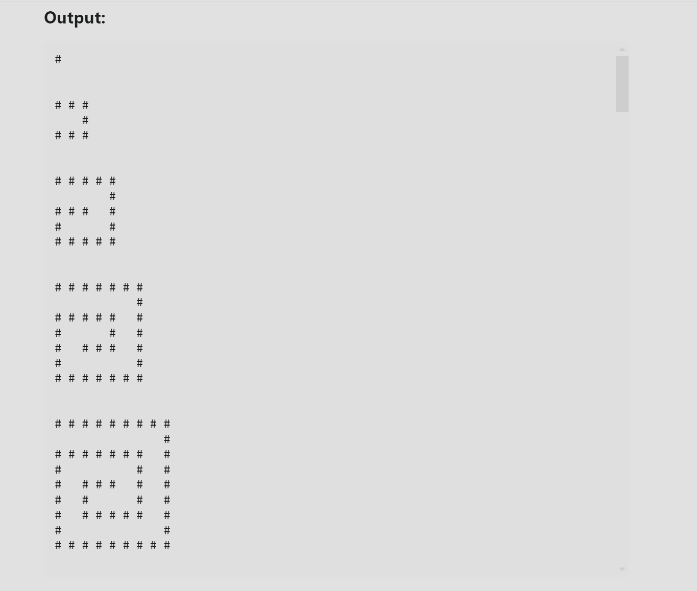

# Generator Spirali Rekurencyjnej (C#)

Prosta aplikacja konsolowa napisana w języku C#, która generuje spiralny wzór w postaci macierzy przy użyciu rekurencji.

Projekt został stworzony jako ćwiczenie algorytmiczne i prezentuje wykorzystanie:

* rekurencji,
* tablic dwuwymiarowych,
* walidacji danych wejściowych,
* generowania wzorców w macierzy,
* aplikacji konsolowych w C#.

## Podgląd działania



## Przykładowe użycie

Dla wartości:

```csharp
GenerateSpiral(9);
```

Program wygeneruje spiralę złożoną z wartości `1` oraz `0` i wyświetli ją w konsoli.

## Jak działa algorytm?

Program tworzy macierz o wymiarach `n × n`, a następnie rekurencyjnie wypełnia jej kolejne warstwy.

Proces działania:

1. Sprawdzenie poprawności argumentu wejściowego.
2. Utworzenie pustej macierzy.
3. Wypełnienie zewnętrznej warstwy spirali.
4. Przejście do kolejnej, wewnętrznej warstwy.
5. Naprzemienne rysowanie wartości `1` i `0`.
6. Zakończenie działania po osiągnięciu środka macierzy.

Za właściwe rysowanie spirali odpowiada metoda:

```csharp
FillSpiral(...)
```

która wywołuje samą siebie dla kolejnych wewnętrznych warstw macierzy.

## Wymagania

* .NET 6.0 lub nowszy
* C#

## Uruchomienie projektu

Sklonuj repozytorium:

```bash
git clone https://github.com/TWOJ_LOGIN/recursive-spiral-generator.git
```

Przejdź do katalogu projektu:

```bash
cd recursive-spiral-generator
```

Uruchom aplikację:

```bash
dotnet run
```

## Ograniczenia danych wejściowych

Program przyjmuje wyłącznie:

* dodatnie liczby całkowite,
* liczby nieparzyste.

Poprawne przykłady:

* 3
* 5
* 9
* 15

Niepoprawne przykłady:

* 0
* -5
* 8

W przypadku podania niepoprawnej wartości zostanie zgłoszony wyjątek.

## Zastosowane zagadnienia

* Rekurencja
* Tablice dwuwymiarowe
* Operacje na granicach macierzy
* Algorytmy generujące wzorce
* Programowanie obiektowe w C#

## Możliwe usprawnienia

W przyszłości projekt można rozbudować o:

* pobieranie rozmiaru spirali od użytkownika,
* testy jednostkowe,
* zapis wyniku do pliku graficznego,
* możliwość wyboru znaków używanych do rysowania spirali,
* porównanie wersji rekurencyjnej i iteracyjnej.

## Autor

Projekt stworzony w celach edukacyjnych jako ćwiczenie z zakresu rekurencji oraz operacji na macierzach w języku C#.
